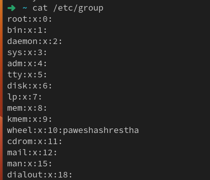
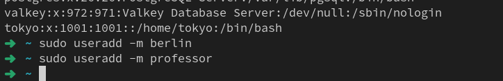
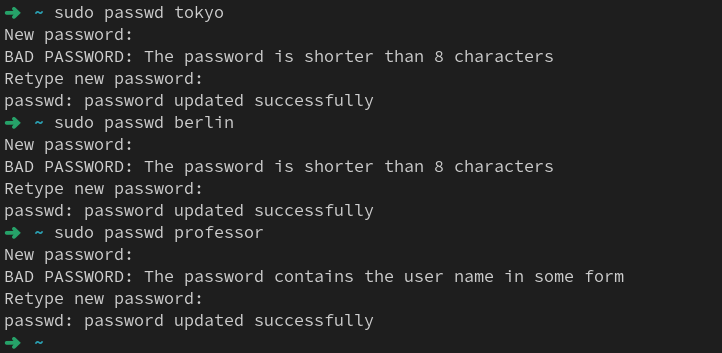
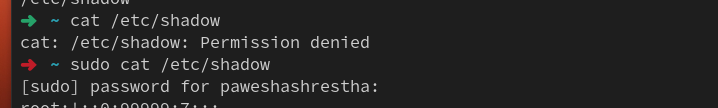
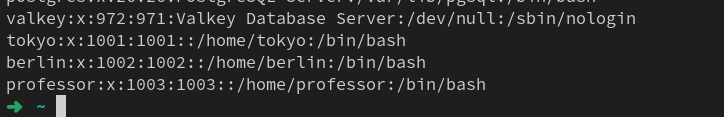
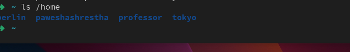
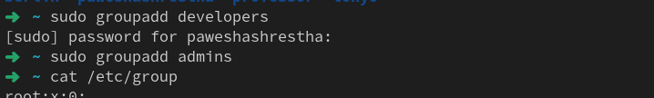
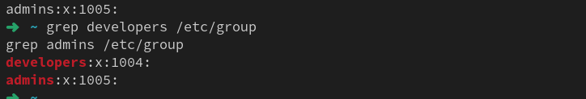

Great challenge. I’ll explain **everything step-by-step with deep understanding**, not just commands. Think of this as a **mini real-world DevOps lab**. 🚀

We will cover:

1. **What users and groups are in Linux**
2. **Where Linux stores user information**
3. **Commands to create users**
4. **Commands to create groups**
5. **Group permissions**
6. **Shared directories**
7. **Testing access**
8. **Final Markdown file**

---

# 1. How Linux User System Works (Very Important)

Linux is a **multi-user system**.

That means **many users can use the same server**.

Example real DevOps server:

| User      | Role              |
| --------- | ----------------- |
| tokyo     | developer         |
| berlin    | developer + admin |
| professor | system admin      |

Instead of giving everyone **root access**, Linux uses:

### 1️⃣ Users

Individual accounts.

Example:

```
tokyo
berlin
professor
```

Each user gets:

```
/home/username
```

Example:

```
/home/tokyo
/home/berlin
/home/professor
```

---

### 2️⃣ Groups

Groups allow **multiple users to share permissions**.

Example:

```
developers
admins
```

So:

```
developers → tokyo, berlin
admins → berlin, professor
```

This is **how DevOps teams manage servers**.

---

# 2. Where Linux Stores User Data

Very important for interviews.

### User database

```
/etc/passwd
```

Check it:

```bash
cat /etc/passwd
```

Example line:

```
tokyo:x:1001:1001::/home/tokyo:/bin/bash
```

Breakdown:

| Field       | Meaning                   |
| ----------- | ------------------------- |
| tokyo       | username                  |
| x           | password stored elsewhere |
| 1001        | UID                       |
| 1001        | GID                       |
| /home/tokyo | home directory            |
| /bin/bash   | default shell             |

---

### Password file

```
/etc/shadow
```

Only root can read it.

```
sudo cat /etc/shadow
```

---

### Group database

```
/etc/group
```

Check:

```
cat /etc/group
```

Example:

```
developers:x:1003:tokyo,berlin
```



---

# TASK 1 — Create Users

We create **3 users with home directories**.

Command:

```
sudo useradd -m tokyo
```

Explanation:

| Part    | Meaning               |
| ------- | --------------------- |
| sudo    | run as admin          |
| useradd | create user           |
| -m      | create home directory |
| tokyo   | username              |

---

### Create all users

```
sudo useradd -m tokyo
sudo useradd -m berlin
sudo useradd -m professor
```



---

### Set passwords

```
sudo passwd tokyo
sudo passwd berlin
sudo passwd professor
```

Linux will ask:

```
New password:
Retype password:
```





---

### Verify users

Check `/etc/passwd`

```
cat /etc/passwd | grep tokyo
```

or

```
grep tokyo /etc/passwd
```

Example output

```
tokyo:x:1002:1002::/home/tokyo:/bin/bash
```



---

### Verify home directories

```
ls /home
```

Expected output

```
tokyo
berlin
professor
```



---

# TASK 2 — Create Groups

Create groups:

```
developers
admins
```

Command:

```
sudo groupadd developers
sudo groupadd admins
```



---

### Verify groups

```
cat /etc/group
```

or

```
grep developers /etc/group
grep admins /etc/group
```

Example:

```
developers:x:1004:
admins:x:1005:
```



---

# TASK 3 — Assign Users to Groups

We use:

```
usermod
```

Syntax

```
sudo usermod -aG group username
```

Explanation:

| Flag | Meaning         |
| ---- | --------------- |
| -a   | append          |
| -G   | secondary group |

Without **-a** it will overwrite groups (dangerous).

---

### Assign tokyo

```
sudo usermod -aG developers tokyo
```

---

### Assign berlin to two groups

```
sudo usermod -aG developers berlin
sudo usermod -aG admins berlin
```

---

### Assign professor

```
sudo usermod -aG admins professor
```

---

### Verify group membership

Command:

```
groups tokyo
```

Example:

```
tokyo : tokyo developers
```

Check all:

```
groups berlin
groups professor
```

Example output

```
berlin : berlin developers admins
professor : professor admins
```


---

# TASK 4 — Shared Directory

Now we simulate **real DevOps shared project folder**.

Developers need access.

---

### Create directory

```
sudo mkdir /opt/dev-project
```

Why `/opt`?

`/opt` = optional software directory.

Used for:

```
/opt/apps
/opt/projects
/opt/dev
```

---

### Change group owner

```
sudo chgrp developers /opt/dev-project
```

Explanation:

```
chgrp = change group
```

---

### Set permissions

```
sudo chmod 775 /opt/dev-project
```

Permission breakdown:

```
775
```

| Digit | Meaning    |
| ----- | ---------- |
| 7     | owner rwx  |
| 7     | group rwx  |
| 5     | others r-x |

So:

```
Owner → full
Group → full
Others → read
```

---

### Verify permissions

```
ls -ld /opt/dev-project
```

Example output

```
drwxrwxr-x 2 root developers 4096 Mar 11 /opt/dev-project
```

Breakdown

```
d → directory
rwx → owner
rwx → group
r-x → others
```


---

### Test file creation

Test as tokyo
-u = user 
```
sudo -u tokyo touch /opt/dev-project/file_tokyo.txt
```

Test as berlin

```
sudo -u berlin touch /opt/dev-project/file_berlin.txt
```

Check:

```
ls /opt/dev-project
```

Expected

```
file_tokyo.txt
file_berlin.txt
```


---

# TASK 5 — Team Workspace

---

### Create user

```
sudo useradd -m nairobi
sudo passwd nairobi
```

---

### Create group

```
sudo groupadd project-team
```

---

### Add members

```
sudo usermod -aG project-team nairobi
sudo usermod -aG project-team tokyo
```

---

### Create workspace directory

```
sudo mkdir /opt/team-workspace
```

---

### Set group
Change group -assign group to a particular directory/file 
```
sudo chgrp project-team /opt/team-workspace
```

---

### Set permissions

```
sudo chmod 775 /opt/team-workspace
```

---

### Test access

```
sudo -u nairobi touch /opt/team-workspace/test.txt
```

Verify

```
ls /opt/team-workspace
```


---

# Real DevOps Insight (Very Important)

This is **exactly how companies manage servers**.

Example company server:

```
developers group → app engineers
admins group → DevOps team
```

Shared directories:

```
/opt/project
/var/www
/home/dev
```

Permissions control **who can deploy code**.

---
