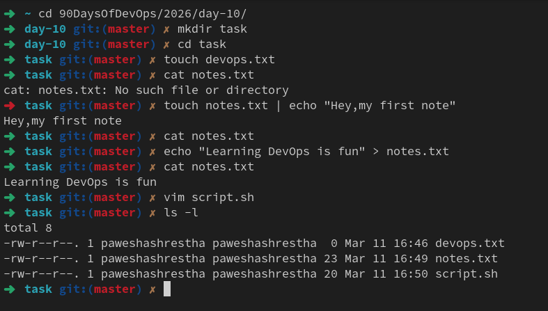

---

# Day 10 – File Permissions & File Operations (Deep Explanation)

We will cover:

1. Creating files
2. Reading files
3. Understanding permissions
4. Changing permissions
5. Testing permission errors

---

# Task 1 — Create Files


# 1️⃣ Create empty file using `touch`

Command:

```bash
touch devops.txt
```

What `touch` does:

| Use               | Meaning               |
| ----------------- | --------------------- |
| create empty file | if file doesn't exist |
| update timestamp  | if file exists        |

Check file:

```bash
ls
```

Output

```
devops.txt
```

---

# 2️⃣ Create file with content using `echo`

Command:

```bash
echo "Learning DevOps is fun" > notes.txt
```

Explanation:

| Part                     | Meaning    |
| ------------------------ | ---------- |
| echo                     | print text |
| "Learning DevOps is fun" | content    |

> | redirect output to file |
> notes.txt | file name |

Check:

```bash
cat notes.txt
```

Output

```
Learning DevOps is fun
```

---

# 3️⃣ Create script using `vim`

Open editor:

```bash
vim script.sh
```

Press `i` (insert mode)

Write:

```
echo "Hello DevOps"
```

Press:

```
ESC
```

Then save:

```
:wq
```

Now verify files:

```bash
ls -l
```

Example output

```
-rw-r--r-- 1 user user 0 Mar 11 devops.txt
-rw-r--r-- 1 user user 22 Mar 11 notes.txt
-rw-r--r-- 1 user user 18 Mar 11 script.sh
```



---

# Understanding `ls -l` Output

Example:

```
-rw-r--r-- 1 pawesha pawesha 18 Mar 11 script.sh
```

Breakdown:

| Part | Meaning |
| ---- | ------- |

- | file |
  rw- | owner permissions |
  r-- | group permissions |
  r-- | others permissions |

---

# Task 2 — Read Files

---

# 1️⃣ Read file using `cat`

Command:

```bash
cat notes.txt
```

Output:

```
Learning DevOps is fun
```

`cat` = **concatenate and display file content**

Used often for:

```
logs
configs
quick file viewing
```

---

# 2️⃣ Open file in **read-only vim**

Command:

```bash
vim -R script.sh
```

`-R` means:

```
read only
```

You cannot edit accidentally.

Exit:

```
:q
```

---

# 3️⃣ View first lines using `head`

Command:

```bash
head -n 5 /etc/passwd
```

Explanation:

| Part | Meaning                |
| ---- | ---------------------- |
| head | show beginning of file |
| -n 5 | number of lines        |

Example output:

```
root:x:0:0:root:/root:/bin/bash
daemon:x:1:1:daemon:/usr/sbin:/usr/sbin/nologin
bin:x:2:2:bin:/bin:/usr/sbin/nologin
sys:x:3:3:sys:/dev:/usr/sbin/nologin
sync:x:4:65534:sync:/bin:/bin/sync
```

---

# 4️⃣ View last lines using `tail`

Command:

```bash
tail -n 5 /etc/passwd
```

Output shows **last users created**.

Very useful for logs:

```
tail -f /var/log/syslog
```

---

# Task 3 — Understand Permissions

Check permissions:

```bash
ls -l devops.txt notes.txt script.sh
```

Example:

```
-rw-r--r-- devops.txt
-rw-r--r-- notes.txt
-rw-r--r-- script.sh
```

---

# Permission Structure

```
rwxrwxrwx
```

Break into 3 groups:

```
rwx | rwx | rwx
owner group others
```

---

# Numeric Permission System

Linux converts permissions to numbers.

| Permission | Value |
| ---------- | ----- |
| r          | 4     |
| w          | 2     |
| x          | 1     |

Example:

```
rw-
```

= 4 + 2 = **6**

---

Example:

```
rwx
```

= 4 + 2 + 1 = **7**

---

So:

```
rw-r--r--
```

means

```
6 4 4
```

---

# Task 4 — Modify Permissions

---

# 1️⃣ Make script executable

Currently:

```
-rw-r--r--
```

Add execute:

```bash
chmod +x script.sh
```

Check:

```bash
ls -l script.sh
```

Output

```
-rwxr-xr-x script.sh
```

Now run script:

```bash
./script.sh
```

Output

```
Hello DevOps
```

---

# 2️⃣ Make `devops.txt` read-only

Remove write permission:

```bash
chmod -w devops.txt
```

Check:

```bash
ls -l devops.txt
```

Example:

```
-r--r--r-- devops.txt
```

Now nobody can modify it.

---

# 3️⃣ Set `notes.txt` to **640**

Meaning:

| User   | Permission |
| ------ | ---------- |
| owner  | rw         |
| group  | r          |
| others | none       |

Command:

```bash
chmod 640 notes.txt
```

Check:

```bash
ls -l notes.txt
```

Output:

```
-rw-r----- notes.txt
```

---

# 4️⃣ Create directory with 755

Create directory:

```bash
mkdir project
```

Set permission:

```bash
chmod 755 project
```

Check:

```bash
ls -ld project
```

Output

```
drwxr-xr-x project
```

---

# Why directories need execute permission

For directories:

| Permission | Meaning         |
| ---------- | --------------- |
| r          | list files      |
| w          | create/delete   |
| x          | enter directory |

Without `x`, you **cannot cd into folder**.

---

# Task 5 — Test Permissions

---

# 1️⃣ Try writing to read-only file

Run:

```bash
echo "test" >> devops.txt
```

Error:

```
Permission denied
```

Because write permission removed.

---

# 2️⃣ Remove execute permission

```bash
chmod -x script.sh
```

Run:

```bash
./script.sh
```

Error:

```
Permission denied
```

Because Linux **cannot execute file**.

---

# Commands You Used Today

```
touch
echo
cat
vim
ls -l
head
tail
chmod
mkdir
```

---


# Real DevOps Example

Example production server:

```
/var/www/app
```

Permissions:

```
drwxr-x---
```

Meaning:

```
owner → devops
group → developers
others → none
```

Only developers can deploy code.

---

# DevOps Interview Question From This

Question:

> Why can't a script run even if you can read it?

Answer:

Because **execute permission is missing**.

---

